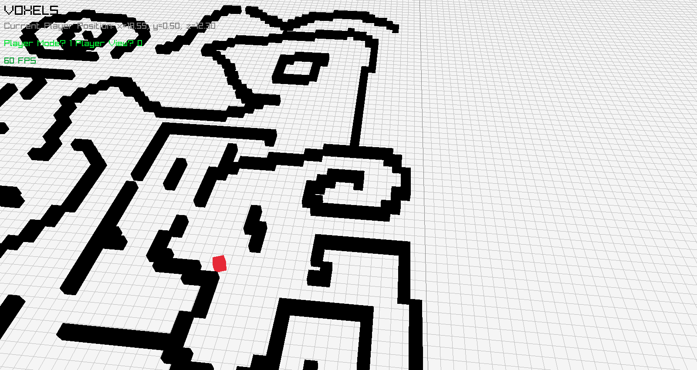
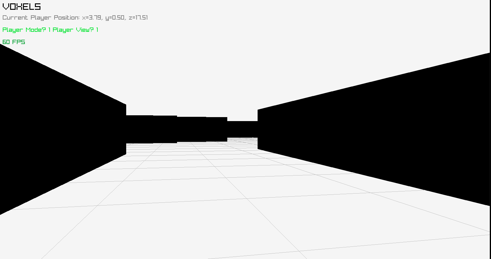

# voxels
Rendering a voxel world using raylib C library.
Voxel is a 3D pixel - i.e. a cube.
World is generated from black voxels.
Location of each World voxel is defined by black and white pixels in .png image.
1 Player voxel (red) is spawned.
Player can be controlled by arrows.
Additionaly "God" view (flight and no collisions) is availabe.
Keys are used to switch between "Player" mode and "God mode".

We are in the proccess of making this both ROS2 testbed and python API environment for reinforcement learning (RL).

For ROS2 testbed (e.g. for __bearnavs__) switch to `ros_api` branch.

Pres 'P' to switch to player mode (to control player movement with arrow keys) and 'V' to player view (currently does nothing).

## ROS API
This branch is Voxel World connected with ROS2.
It is not working yet.

### QUICK START

__You need to install raylib [(https://www.raylib.com/)]__
If raylib is up and running, then create ROS2 workspace, clone this branch.
```
mkdir -p voxel_world_ws
cd voxel_world_ws
git clone --branch ros_api git@github.com:maximsimon/voxels.git
```
Now it's sketchy (I really have to fix this later) - reaname this git (*voxels*) to src and then compile and source:
```
mv voxels src
colcon build
source install/setup.bash
```
Run:
```
ros2 run ros_voxels ros_voxels_main_node
```

*Note: If it throws `Segmentation error` and the simulation window crashes, it is most likely structural error in how you built it.*

My file strcture where it's running looks like this:
```
voxel_world_ws/src/
├── core_voxels
│   ├── CMakeLists.txt
│   ├── include
│   ├── resources
│   └── src
├── documentation
│   ├── DOCUMENTATION.md
│   └── figures
├── README.md
└── ros_voxels
    ├── CMakeLists.txt
    ├── include
    ├── LICENSE
    ├── package.xml
    └── src
```
and I run `colcon build` and `ros2 run` from `voxel_world_ws/`.

If you want to run this with __bearnav__ then:
Compile and run normally (with `colcon build` and `ros2 run`).
Now simulation is running independently and ROS2 is active -> you can launch bearnav in completiely different workspace and treat the topics and action services provided by this simulation as you would if they were coming from robot (Note: this statement is the goal, however it's not impemented yet).

See `documentation/` for more detailed description of code structure, available functions etc.

## Dependencies
I don't know all - did not test that yet.
I'm developing this on Ubuntu 20.

__Most definitely you need to install Raylib.__[(https://www.raylib.com/)]
`#include "raylib.h"` needs to work.

Also __gcc__ compiler (check `Makefile` for compilation details).

See `documentation/` for more detailed description of code structure, available functions etc.



