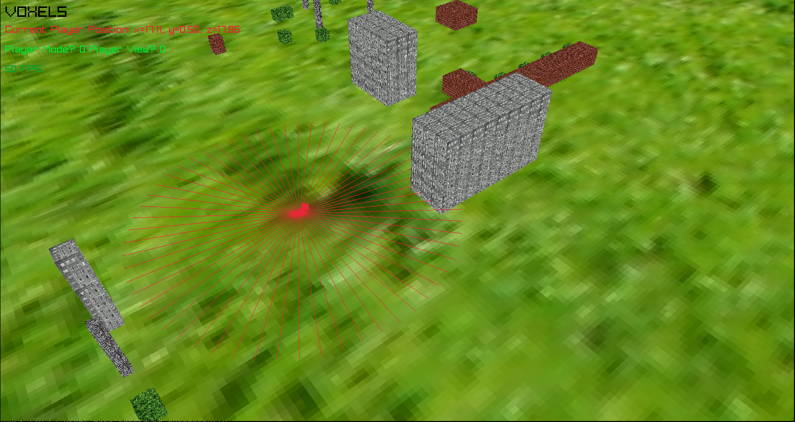
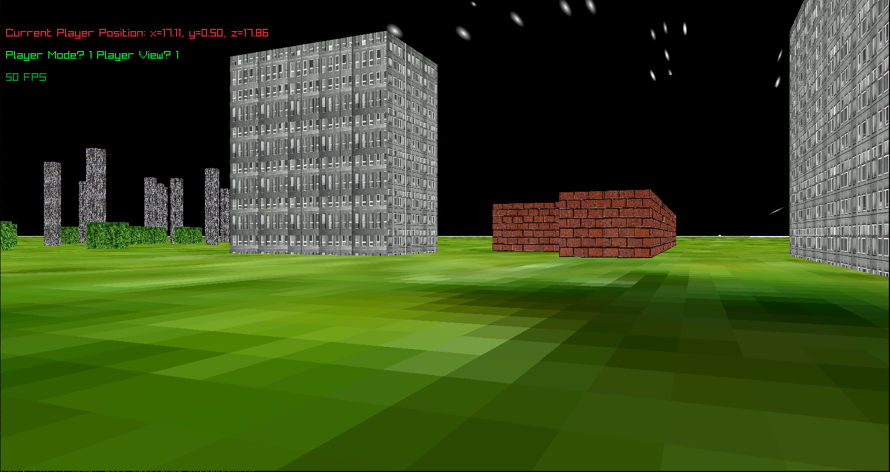

# Ros Voxels README
## this branch is underconstruction - contains no ROS API, here is python API instead

A lightweight, voxel-based robot simulator for **ROS 2** with [raylib](https://www.raylib.com/) rendering.

Generate a block world from a 2D pixel image, drive a robot around it with keyboard or ROS commands, and get camera images + odometry + lidar scan as real-time ROS topics. Designed as a testbed for high-level navigation strategies.

Extended documentation can be found in `documentation/`.

[***Paper*** (or rather extended abstract)](https://mobile-robotics-hub.github.io/workshop2026/papers/LoWi2026_P11.pdf)




---

## pythonAPI BRANCH

This branch is for using the simulation for Reinforcment Learning - mainly from python, but cpp should also be possible.	\
For use of Voxels simulation with ROS, see ros2_api.
  
1. To use this branches version, put your python code in examples/ \
2. `cmake -S . -B build`
3. build: `cmake --build build`
3. run: `PYTHONPATH=build examples/python_drive.py`
(or `./build/master_main` for purely cpp version)

### Prerequisities: OpenCV, raylib, pybind11, numpy

---

## Python API

```python
import numpy as np, voxel_sim

voxel_sim.Configure(target_fps=0, render_gui=False)   # optional, see below
obs = voxel_sim.Init()                                # once per process
while obs["running"]:
    obs = voxel_sim.Step(np.array([3, 0, 0, 0, 0.5, 0], dtype=np.float32))
obs = voxel_sim.Reset("ConferenceWorld", (10.0, 4.0, 90.0))
voxel_sim.Close()
```

| call | what it does |
| ---- | ------------ |
| `Init()` | build the world and return the first observation |
| `Step(action)` | advance one step; `action` is 6 floats `[vx,vy,vz, wx,wy,wz]` (m/s, rad/s) |
| `Reset(world, position)` | start a new episode: `world` is a name from `voxel_sim.WORLDS` or `None` to keep the current one, `position` is `(x, z)` or `(x, z, yaw_deg)` or `None` to keep the pose. The world is only rebuilt when it actually changes (~1 s), so resetting inside one world costs ~1 ms. |
| `Teleport(x, z, yaw_deg)` | move the robot at the next step, without ending the episode |
| `Configure(**params)` | set the runtime parameters below |
| `GetConfig()` | every parameter and its current value |
| `CurrentWorld()` | name of the world currently loaded |
| `Close()` | release the world and the window |

Observation dict: `camera_front` (uint8 `[H,W,3]` BGR, or `None` when the camera is off),
`position`, `orientation`, `yaw` (floor-plane heading from +x, radians), `linear_vel`,
`angular_vel`, `lidar_scan`, `running`.

### Parameters

`Configure()` takes any of these as keyword arguments. Defaults reproduce the original
behaviour, so nothing changes unless you opt in. The five marked **init** are read when
the window is created and must be set before `Init()`.

| parameter | default | effect |
| --------- | ------- | ------ |
| `fixed_dt` | `0.02` | simulated seconds per `Step()`. Fixed by default, so a step advances the same amount of simulated time however long it took — this is what makes rollouts reproducible. `<= 0` reverts to integrating real elapsed wall time. |
| `target_fps` | `50` | frame-rate cap; `0` removes it |
| `show_window` | `True` | **init** — `False` never maps the window |
| `render_gui` | `True` | `False` skips the third-person pass (a second draw of the whole world) |
| `screen_width`/`screen_height` | `1600`/`850` | **init** — window size |
| `camera_width`/`camera_height` | `1600`/`850` | **init** — robot camera resolution. The camera is always on; this is the knob that matters, since cost is roughly 3 ns per pixel. |
| `lidar_enabled` / `lidar_rays` / `lidar_range` | `True` / `180` / `40.0` | `lidar_rays` is capped at the `NUM_LIDAR_RAYS` build constant |
| `draw_lidar_rays` | `True` | scan lines in the third-person view |
| `fast_collisions` | `False` | test the robot footprint against the occupancy grid instead of the chunk meshes — far cheaper, but a cell counts as fully blocked, so sub-cell objects collide as full 1x1 blocks |
| `collision_radius` | `0.5` | half-width of the robot footprint |
| `max_linear_speed` / `max_angular_speed` | `0` / `0` | ceilings applied to the action; `0` means no limit |
| `keyboard_enabled` | `True` | `False` stops window keypresses from moving the robot — needed for reproducible rollouts |
| `quit_key_enabled` | `True` | whether Q ends the run |
| `verbose` | `True` | raylib and world-build logging |

### Simulation speed

Measured on this machine, stepping the ConferenceWorld with the robot moving in open space
(the worst case for collision checking):

| configuration | steps/s |
| ------------- | ------: |
| defaults (50 Hz cap, 1600x850 camera) | 50 |
| `target_fps=0` | 185 |
| `+ render_gui=False` | 186 |
| `+ show_window=False`, camera 512x320 | 1232 |
| `+ fast_collisions=True` | 1636 |

The robot camera dominates: rendering the POV, reading it back to the CPU and handing it to
numpy costs roughly **3 ns per pixel**, which is memory-bandwidth-bound CPU work rather than
a GPU stall. Resolution is therefore the lever that matters:

| camera resolution | pixels | steps/s |
| ----------------- | -----: | ------: |
| 128x80 | 10k | 5600 |
| 256x160 | 40k | 3970 |
| 512x320 | 164k | 1600 |
| 1024x640 | 655k | 530 |

Everything that is not the camera — physics, collisions with `fast_collisions`, 180 lidar
rays, and presenting the window — adds up to about 0.06 ms/step, against 0.67 ms/step for
the camera at 512x320. Not mapping the main window is therefore free but also not worth
much; shrinking the camera is where the time is. Collision checking is the only other
lever with real weight, and only once the camera is small (mesh footprint costs ~1 ms/step
in open space, grid footprint ~0.01 ms).

---

## Examples

Run from the repository root; the simulator resolves its resources relative to it.

| script | what it does |
| ------ | ------------ |
| `examples/python_drive.py` | minimal Init/Step/Close loop at the stock settings |
| `examples/vtr_map.py` | loads a VTR teach map (`examples/maps/`) — a self-contained MCAP/CDR reader, no ROS needed. Run it directly to print a summary of each map. |
| `examples/python_informed_repeat.py` | drives a taught trajectory in minimum wall time |
| `examples/repeat_sweep.sh` | runs both maps under a range of parameter values and prints a comparison table |

```bash
PYTHONPATH=build python3 examples/python_informed_repeat.py            # both maps
PYTHONPATH=build python3 examples/python_informed_repeat.py --gui      # watch it
PYTHONPATH=build python3 examples/python_informed_repeat.py --help     # all options

./examples/repeat_sweep.sh                       # parameter comparison table over both maps
VOXELS_DETAIL=1 ./examples/repeat_sweep.sh      # ...with each map broken out
VOXELS_REPEATS=3 ./examples/repeat_sweep.sh     # best of N runs per row, for quieter numbers
VOXELS_BUILD=<dir> ./examples/repeat_sweep.sh   # a build directory other than build/
VOXELS_PYTHON=<exe> ./examples/repeat_sweep.sh  # a specific interpreter
```

`repeat_sweep.sh` takes no arguments and can be run from any directory — it finds the repo
root from its own location, locates the build directory itself, and picks the interpreter
CMake was configured against (recorded in `CMakeCache.txt`), which is not necessarily the
`python3` first on `PATH`. Its overrides are `VOXELS_`-prefixed deliberately: a bare `BUILD`
is unusable because conda's compiler packages export `BUILD=x86_64-conda-linux-gnu` whenever
an environment is activated.

`repeat_sweep.sh` fixes the agent camera at 512x320 for every row and renders nothing else -
no third-person view, no mapped window - so the rows differ only in the parameter named. It
prints the observation contents up front to show that each row still produces a full
observation: camera image, pose, yaw, velocities and lidar.

`examples/maps/` holds two visual-teach-and-repeat maps recorded against this simulator
through the ROS 2 bridge: camera frames plus a bag of odometry and commanded actions. They
were taught in the world `core_voxels/resources/worlds/worlds.config` selects, so the
repeat script never switches worlds.

The repeat is *informed*: it steers by the map's recorded poses rather than re-localizing
visually. `--steps-per-meter` (default 5) sets the sampling density along the path and
picks `fixed_dt` from the commanded speed to hit it; because the controller only ever slows
down, that density is a floor. Both taught paths (115 m total) are followed to within
9 cm mean cross-track error in about 0.26 s of wall time.

**Note on the yaw convention**: a positive commanded yaw rate makes the reported `yaw`
*decrease* by the matching amount — the sign is flipped relative to `yaw`/`position` and to
REP-103. The magnitude is exact and the taught maps were recorded through the same
convention, so it is left alone here; `YAW_RATE_SIGN` in `python_informed_repeat.py`
isolates it.

---

**NOTE**: info below is targeted for ros2_api branch and may be (probably is) incorrect for this python_api branch.

---

## Quick Start

```bash
## Prerequisites: 

### ROS 2 Jazzy, raylib, OpenCV
sudo apt install libraylib-dev libopencv-dev

#### add user to the input group for reading key presses to control robot
sudo usermod -a -G input $USER
now log out and back in, when you run `groups` you should see `input` listed

###raylib
either from __[(https://www.raylib.com/)]__ or by:
sudo add-apt-repository ppa:texus/raylib
sudo apt update
sudo apt install libraylib5-dev

## Build
mkdir -p ~/voxel_world_ws/src
cd ~/voxel_world_ws/src
git clone <this-repo> ros_voxels
cd ~/voxel_world_ws
colcon build
source install/setup.bash

# Run (must be from workspace root for resource paths)
./install/ros_voxels/lib/ros_voxels/master_main
```

A window opens showing Voxels - the voxel world simulation. Fly with **Arrows**, **PgUp, PgDn** and **WASD**. Press **P** to enable player mode (**O** to disble it), then use **WASD** to move and **KL** to turn. Press **V** for first-person view (robot POV).


---

## Features

- **Procedural voxel world** generated from a 2D pixel image (.png, .jpg, ...)
- **Monocular camera** — `sensor_msgs/Image` at 50 Hz (BGR8, 1600×850)
- **Ground-truth odometry** — `nav_msgs/Odometry` + TF (`odom` → `base_link`)
- **planar LiDAR laser scan** — `sensor_msgs/LaserScan`
- **Velocity control** — `cmd_vel_subscriber` (`TwistStamped`)
- **Teleport** — `/initialpose` for resetting robot position
- **Keyboard teleop** — raw `/dev/input/` reads for low-latency control
- **1st and 3rd person view** — god mode (free-fly) + player mode (first-person)

---

## ROS 2 Interface

| Topic | Type | Direction |
|-------|------|-----------|
| `/camera_front_publisher` | `sensor_msgs/Image` | Published |
| `/odometry_publisher` | `nav_msgs/Odometry` | Published |
| `/lidar_scan` | `sensor_msgs/LaserScan` | Published |
| `/cmd_vel_publisher` | `geometry_msgs/TwistStamped` | Published |
| `/cmd_vel_subscriber` | `geometry_msgs/TwistStamped` | Subscribed |
| `/initialpose` | `geometry_msgs/PoseWithCovarianceStamped` | Subscribed |

**TF**: `odom` → `base_link` (broadcast at 50 Hz)

---

## Controls

| Key | Mode | Action |
|-----|------|--------|
| P | Any | Enable player mode |
| O | Any | Disable player mode |
| V | Any | Toggle first-person view |
| WASD | Player | Move robot |
| KL | Player | Rotate robot |
| Arrows | God | Move camera |
| WASD | God | Rotate camera |
| PgUp/PgDn | God | Move up/down |
| T | Any | Teleport input ("x z yaw_deg") |
| Space | Any | Screenshot |
| Q or Esc | Any | Quit |

---

## Repository Structure

```
ros_voxels/
├── CMakeLists.txt              # ROS 2 package build
├── package.xml                 # ROS 2 manifest
├── core_voxels/                # Simulation engine (no ROS deps)
│   ├── include/                #   Headers
│   ├── src/                    #   Implementation (10 source files)
│   └── resources/              #   Map images + textures
├── ros_voxels/                 # ROS 2 glue library
│   ├── include/
│   └── src/
├── master_main/                # Main entry point (executable)
│   ├── include/
│   └── src/
└── documentation/                       # Full documentation suite
    ├── architecture.md
    ├── software_design.md
    ├── simulation_model.md
    ├── api_reference.md
    └── README.md (this file)
```

---

## Documentation
Find detailed documentation in `documentation/`:

| Document              | Content                                                        |
| --------------------- | -------------------------------------------------------------- |
| `README.md`           | Intro to documentation                                         |
| `index.md`            | List of all functions and some variables - with short comments |
| `architecture.md`     | System architecture, data flow, threading model                |
| `software_design.md`  | Detailed module design, algorithms, data types                 |
| `simulation_model.md` | World model, physics, sensor models, coordinate frames         |
| `api_reference.md`    | Full ROS 2 interface, library API reference                    |

---

## Requirements

- **ROS 2** Humble / Iron / Jazzy (tested on Jazzy)
- **C++14** compiler
- **raylib** (tested on ≥ 4.5)
- **OpenCV** (tested on ≥ 4.2)
- **X11**, OpenGL (for raylib rendering)

---

## License

Apache 2.0. See `LICENSE`.
