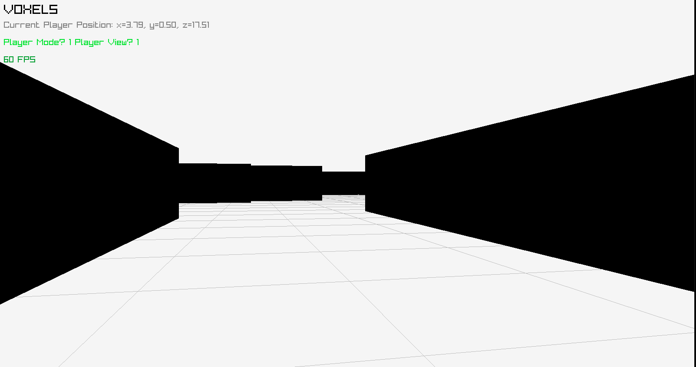

# voxels
Rendering a voxel world using raylib.
Voxel is a 3D pixel - i.e. a cube.
World is generated from black voxels.
Location of each World voxel is defined by black and white pixels in .png image.
1 Player voxel (red) is spawned.
Player can be controlled by arrows.
Additionaly "God" view (flight and no collisions) is availabe.
Keys are used to switch between "Player" mode and "God mode".

## ROS API
This branch is Voxel World connected with ROS2.
Obsevration space is published trough topics and such.
Action space is available trough topics and action commands etc.

observatin space contains: position, odometry, current camera view

action space contains: velocity commands

If you want to run this with __bearnav__ then:
compil in ros workspace with `colcon build` then `source install/setup.bash` then run with `ros2 run node_voxels node_voxels_exe`

Now simulation is running independently and ROS2 is active -> you can launch bearnav in completly different workspace and treat the topics and action services provided by this simulation as yoou would if they were coming from robot (Note: this stateent is the goal, however I have not tested it yet).

__Compile by `make` then run `voxel.o` executable.__

Currently can generate voxel at given location and it can load a pixel map (.png image) and place a voxel at each pixel - mazebuilding from image.
Can only handle about 32x32 map - generating beyond that does not yet work.

Collisions are sometimes still sticky - the Player voxel does not slide reliably along walls after collision.
Collisions are calculated by shooting ray upwards from defined boundry points of the Player voxel (Note: they have padding against the voxel), and checking if those rays collide with the map's mesh.

## Dependencies
I don't know all - did not test that yet.
I'm developing this on Ubuntu 20.

__Most definitely you need to install Raylib.__[(https://www.raylib.com/)]
`#include "raylib.h"` needs to work.

Also __gcc__ compiler (check `Makefile` for compilation details).

## Code structure

I'm using __raylib.h__ library + I write my own additional resources, often heavily based on functions provided in the raylib library.

Main file (with main()) is in `voxel.c`.
`while(!WindowShouldClose() && !IsKeyPressed(KEY_Q)) {` in `voxel.c' is the loop where the simulation window runs.

Additional `.h` files provide functionalities.
E.g. `map.h` generates map (in form of an array) of the world base on input picture.
`faces.h` handles generation of 1 voxel mesh face (side) by face.

In `map\_images` there are .png files, which are few pixels times few pixels images that encode walls in the world.
You could say Voxel World is build generatively.
Black pixel means 1 voxel. White pixel means no voxel. Other options are unavailable at this moment.
Warning: Pixels have to be black or white, transparent ones do not work.
Note: not all of the images were used, not all of them works. `map\_images` repository is not cleaned properly.
Loaded 'map' image is specified in `map.h`

`illustration\_images' contains pictures used for this `README.md` and possibly other presentation stuff.

## DOCUMENTATION of available functions (definitely not complete, just one or few functions so far):

Note: I'm using both raylib libraries and my own `.h` files I've created so far. Lot of functions in them are slightly edited functions from raylib library.

__`getUpDireciton`, `getForwardDirection` etc (`get...Direction`)__ - it is in 'small\_handy\_stuff.h':
*returns vector (warning: the vector is not neccasrly normalized) with start at the origin of the world grid and pointing in direction as follows:*
__Up__ - normalized vector pointing UP with respect to the world grid
__Down__ - normalized vector pointing DOWN with respect to the world grid

__Forward, Back__ - points in direction in front of or behind, respectively, of the robot. So forward or back with respect to the robot's orientation.
__Left, Right__ - points in direction to the left or right, respectively, of the robot. So left or right with respect to the robot's orientation.

