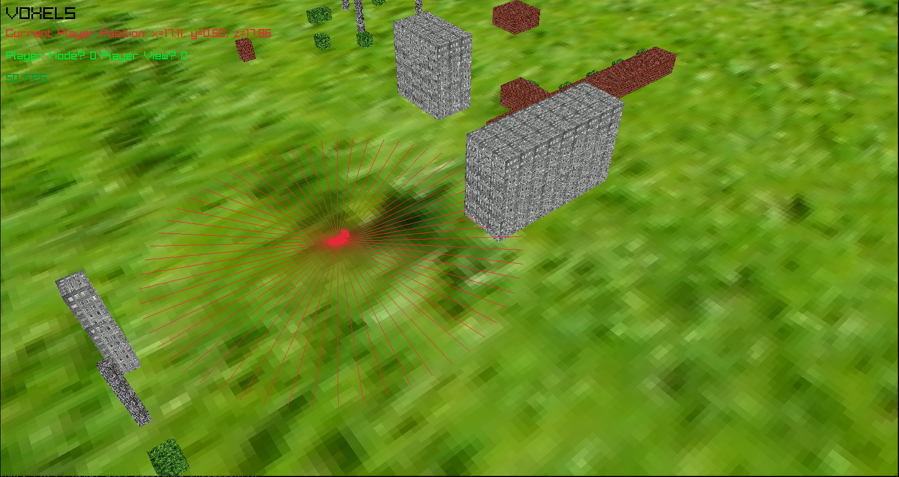
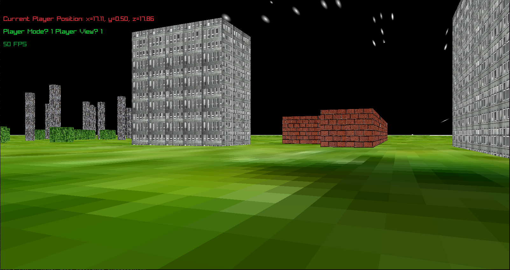

# Voxel World

**This branch (python_api_devel) is under construction. Some info listed below may consern other (ROS) branches only or be outdated!**

A lightweight, voxel-based robot simulator with [raylib](https://www.raylib.com/) rendering,
built as a testbed for navigation strategies — mainly reinforcement learning driven from Python.

Generate a block world from a 2D pixel image (hand-drawn or procedurally generated), drive a
robot around it with the keyboard or a 6-float action vector, and get camera images, pose,
velocities and a lidar scan back on every step.

> **This branch (`python_api_devel`) exposes a Python API and contains no ROS code.**
> The ROS 2 API lives on the `ros2_api` branch; `documentation/` was written for that branch
> and is marked accordingly below.

Extended documentation can be found in `documentation/`.

[***Paper*** (or rather extended abstract)](https://mobile-robotics-hub.github.io/workshop2026/papers/LoWi2026_P11.pdf)




---

## Quick start

### Prerequisites: OpenCV, raylib, pybind11, numpy

```bash
# build the C++ core and the `voxel_sim` Python module
cmake -S . -B build
cmake --build build

# drive the robot from Python (run from the repository root)
python3 scripts/play.py

# or run the standalone C++ binary — a window with the same controls
./build/master_main
```

Every resource path is resolved relative to the repository root, so run everything from here.

---

## Python API

```python
import numpy as np, voxel_sim

voxel_sim.Configure(target_fps=0, show_window=False)  # optional, see below
obs = voxel_sim.Init()                                # once per process
while obs["running"]:
    obs = voxel_sim.Step(np.array([3, 0, 0, 0, 0.5, 0], dtype=np.float32))
obs = voxel_sim.Reset("ConferenceWorld", (10.0, 4.0, 90.0))
voxel_sim.Close()
```

| call | what it does |
| ---- | ------------ |
| `Init()` | build the world and return the first observation |
| `Step(action)` | advance one step; `action` is 6 floats `[vx,vy,vz, wx,wy,wz]` (m/s, rad/s) |
| `Reset(world, position)` | start a new episode: `world` is a name from `voxel_sim.WORLDS` or `None` to keep the current one, `position` is `(x, z)` or `(x, z, yaw_deg)` or `None` to keep the pose. The world is only rebuilt when it actually changes (~1 s), so resetting inside one world costs ~1 ms. |
| `Teleport(x, z, yaw_deg)` | move the robot at the next step, without ending the episode |
| `Configure(**params)` | set the runtime parameters below |
| `GetConfig()` | every parameter and its current value |
| `CurrentWorld()` | name of the world currently loaded |
| `WorldInfo(name)` | full definition of a registered world as a dict (`name`, `map`, `atlas`, `ground`, `sky`, `atlas_cols`/`atlas_rows`, `colors`); `name=None` gives the world currently loaded |
| `ReloadRegistry(path)` | replace the world registry with another file and refresh `WORLDS` |
| `Close()` | release the world and the window |

`voxel_sim.WORLDS` is the tuple of registered world names, populated at import time from
`core_voxels/resources/worlds/worlds.config`. `NUM_LIDAR_RAYS` and `MAX_LIDAR_RANGE` are the
build-time lidar capacity and default range. `voxel_sim.reset` is a lowercase alias of `Reset`.

Observation dict: `camera_front` (uint8 `[H,W,3]` BGR, or `None` when the camera is off),
`position`, `orientation`, `yaw` (floor-plane heading from +x, radians), `linear_vel`,
`angular_vel`, `lidar_scan`, `running`.

### Parameters

`Configure()` takes any of these as keyword arguments. Defaults reproduce the original
behaviour, so nothing changes unless you opt in. The five marked **init** are read when
the window is created and must be set before `Init()`.

| parameter | default | effect |
| --------- | ------- | ------ |
| `fixed_dt` | `0.02` | simulated seconds per `Step()`. Fixed by default, so a step advances the same amount of simulated time however long it took — this is what makes rollouts reproducible. `<= 0` reverts to integrating real elapsed wall time. |
| `target_fps` | `50` | frame-rate cap; `0` removes it |
| `show_window` | `True` | **init** — `False` never maps the window |
| `render_gui` | `True` | `False` skips the third-person pass (a second draw of the whole world) |
| `screen_width`/`screen_height` | `1600`/`850` | **init** — window size |
| `camera_width`/`camera_height` | `1600`/`850` | **init** — robot camera resolution. The camera is always on; this is the knob that matters, since cost is roughly 3 ns per pixel. |
| `lidar_enabled` / `lidar_rays` / `lidar_range` | `True` / `180` / `40.0` | `lidar_rays` is capped at the `NUM_LIDAR_RAYS` build constant |
| `draw_lidar_rays` | `True` | scan lines in the third-person view |
| `fast_collisions` | `False` | test the robot footprint against the occupancy grid instead of the chunk meshes — far cheaper, but a cell counts as fully blocked, so sub-cell objects collide as full 1x1 blocks |
| `collision_radius` | `0.5` | half-width of the robot footprint |
| `max_linear_speed` / `max_angular_speed` | `0` / `0` | ceilings applied to the action; `0` means no limit |
| `keyboard_enabled` | `True` | `False` stops window keypresses from moving the robot — needed for reproducible rollouts |
| `quit_key_enabled` | `True` | whether Q ends the run |
| `verbose` | `True` | raylib and world-build logging |

### Simulation speed

Measured on this machine, stepping the ConferenceWorld with the robot moving in open space
(the worst case for collision checking):

| configuration | steps/s |
| ------------- | ------: |
| defaults (50 Hz cap, 1600x850 camera) | 50 |
| `target_fps=0` | 185 |
| `+ render_gui=False` | 186 |
| `+ show_window=False`, camera 512x320 | 1232 |
| `+ fast_collisions=True` | 1636 |

The robot camera dominates: rendering the POV, reading it back to the CPU and handing it to
numpy costs roughly **3 ns per pixel**, which is memory-bandwidth-bound CPU work rather than
a GPU stall. Resolution is therefore the lever that matters:

| camera resolution | pixels | steps/s |
| ----------------- | -----: | ------: |
| 128x80 | 10k | 5600 |
| 256x160 | 40k | 3970 |
| 512x320 | 164k | 1600 |
| 1024x640 | 655k | 530 |

Everything that is not the camera — physics, collisions with `fast_collisions`, 180 lidar
rays, and presenting the window — adds up to about 0.06 ms/step, against 0.67 ms/step for
the camera at 512x320. Not mapping the main window is therefore free but also not worth
much; shrinking the camera is where the time is. Collision checking is the only other
lever with real weight, and only once the camera is small (mesh footprint costs ~1 ms/step
in open space, grid footprint ~0.01 ms).

---

## Vectorized environments (parallel RL)

Try it out quickly:

```bash
python3 scripts/worldgen/example_vecenv_rollout.py --dataset wtest --timing
python3 scripts/worldgen/example_vecenv_rollout.py --dataset wtest --mosaic   # watch
```

RL collects more samples per wall second from *many parallel environments*, and this
simulator can provide them — as **separate processes**, not threads. raylib allows exactly
one window / OpenGL context per process, and the sim keeps its state in process globals
(`sim_params`, `CurrentWorld`, the `master_action`/`master_observation` buffers), so N
instances means N processes. `scripts/vector_env/vec_env.py` wraps all of that in a
gymnasium-style `VecEnv` and ships observations to Python as numpy arrays stacked along a
leading `[N, ...]` dimension:

```python
import numpy as np
from vec_env import VecEnv

env = VecEnv(n_envs=8)                       # 8 processes, each its own (hidden) window
obs = env.reset(["ConferenceWorld"] * 8, [(0.0, 0.0, 90.0)] * 8)
while obs["running"].all():
    acts = np.zeros((8, 6), dtype=np.float32)  # one [vx,vy,vz, wx,wy,wz] row per env
    obs, reward, terminated, truncated, info = env.step(acts)
    # train on the batch: obs["camera_front"] is [8,H,W,3] uint8 BGR, obs["lidar_scan"] [8,180], ...
env.close()
```

| call | what it does |
| ---- | ------------ |
| `VecEnv(n_envs, config=None, worlds=None, start_method="fork", show_mosaic=False)` | start N workers, each `Configure`d headless then `Init()`ed; blocks until every window and world is up |
| `env.reset(worlds, positions)` | new episode in every env; `worlds`/`positions` apply to all or are listed per-env → stacked obs `[N, ...]` |
| `env.step(actions)` | `actions` is `[N,6]` float32 → `(obs, reward, terminated, truncated, info)` |
| `env.reset_at(i, world, pos)` | reset one env inside an episode (its obs is returned unstacked) |
| `env.reset_many(indices, worlds, positions)` | reset several envs in **one pipelined call** — a world switch rebuilds the world, so doing them concurrently costs a single rebuild in wall time. This is how the RL trainer swaps worlds at episode boundaries. |
| `env.load_worlds(source)` | read a dataset folder under `resources/generated/` and return its world-name tuple (one per dataset entry) |
| `env.worlds` | the tuple of worlds this env is allowed to use |
| `env.num_envs`, `env.action_shape` | `N` and `(6,)` |
| `env.close()` / context manager | shut the workers down and release their windows/GL contexts |

Details:

- **Speed**: each process steps independently on its own core, so aggregate sample
  throughput scales towards N× a single env until cores or memory bandwidth (the camera
  readback, ~3 ns/px, is shared DRAM bandwidth) saturate. The default worker config is the
  fast one from the table above (hidden window, no third-person pass, 128x80 camera, grid
  collisions).
- **Construction rule**: create the `VecEnv` *before* any `voxel_sim.Init()` in the same
  process — forking (or spawning) a child under an existing raylib window would duplicate
  that GL context into the workers.
- **Config**: pass a dict (applied to every env) or a list of N dicts to `VecEnv(n_envs,
  config=...)`, e.g. `config={"camera_width": 256, "camera_height": 160, "fixed_dt": 0.02}`.
  Click the same knobs as `voxel_sim.Configure()`.
- **Uniformity**: camera resolution and `lidar_rays` must match across envs (stacking).
- **Reward**: the sim computes no reward; set `env.reward_fn = lambda obs, acts: ...` and
  `step()` will call it, or compute rewards in your own loop.
- **Mosaic**: `show_mosaic=True` (or the `h`/`s` keys) opens one tiled window showing every
  worker's camera at once — `scripts/vector_env/wrapper.py` implements it.
- This composes with GPU-side learning: the envs run on CPU in parallel while your policy
  trains on the GPU; observations are plain numpy, so they move to a GPU tensor trivially.

---

## Scripts

Everything under `scripts/` runs from the repository root.

| script | what it does |
| ------ | ------------ |
| `scripts/play.py` | open a window and drive with the keyboard; records every pose visited to a trail CSV (`--world`, `--spawn-x/z`, `--outdir`) |
| `scripts/visualize_trail.py` | read a trail CSV and scatter natural obstacles along the driven path — produces a map for RL obstacle-avoidance training |
| `scripts/worldgen/` | procedural dataset generator: map images, texture atlas, registry, manifest. See `scripts/worldgen/README.md` |
| `scripts/worldgen/generate_all.py` | `python3 -m scripts.worldgen.generate_all --dataset myds --count 24` writes `core_voxels/resources/generated/myds/` |
| `scripts/worldgen/example_vecenv_rollout.py` | build every world of a dataset in parallel, spawn alive, report lidar and timings (`--timing`, `--mosaic`) |
| `scripts/vector_env/vec_env.py` | the `VecEnv` class described above |
| `scripts/rl/` | the RL training setup: config, trainer, buffer, policy, reward, algorithm. See `scripts/rl/README.md` |
| `scripts/rl/rl_main.py` | `PYTHONPATH=build python3 scripts/rl/rl_main.py` — one training run |

### World generation

```bash
# generate a dataset: N maps + atlas sets + a registry + a Python manifest
python3 -m scripts.worldgen.generate_all --dataset myds --count 24

# check it in the real simulator: build every world, spawn, report lidar and timings
python3 scripts/worldgen/example_vecenv_rollout.py --dataset myds --timing
```

Point the RL setup at it by setting `world_folder` in `scripts/rl/rl_config.py` to
`core_voxels/resources/generated/myds` — the folder is loaded directly, so no edit to
`core_voxels/resources/worlds/worlds.config` is needed. Generated datasets are gitignored.

### Reinforcement learning

```bash
PYTHONPATH=build python3 scripts/rl/rl_main.py
```

`scripts/rl/README.md` explains the whole setup file by file. The short version: the policy,
the reward function and the learning algorithm are three pluggable classes selected by one
line each in `rl_main.py`, and every number lives in `rl_config.py`. **The learner is
currently a placeholder** — it collects rollouts, computes returns and logs batch statistics
without updating any parameters. The observation boundary (`obs_features.py`) already splits
each observation into a `uint8` pixel branch and a float32 state branch, so wiring in a
convolutional policy and a real algorithm (PPO) is the remaining work.

---

## Controls

The window accepts these keys (disabled while `keyboard_enabled=False`):

| Key | Mode | Action |
|-----|------|--------|
| P | Any | Enable player mode |
| O | Any | Disable player mode |
| V | Any | Toggle first-person view |
| Arrows | Player | Move robot (Up/Down forward-back, Left/Right strafe) |
| A / D | Player | Rotate robot left / right |
| Arrows | God | Move camera |
| WASD | God | Rotate camera |
| PgUp/PgDn | God | Move up/down |
| T | Any | Teleport input ("x z yaw_deg") |
| R | Any | Reload the current world definition live |
| Space | Any | Screenshot |
| Q or Esc | Any | Quit |

Actions are treated as proper REP-103 velocities (m/s and rad/s) and scaled by `fixed_dt`
before being integrated — see `core_voxels/src/support_for_master.cpp:34-62`.

---

## Repository structure

```
voxels/
├── CMakeLists.txt              # builds core_voxels, master_main_core, voxel_sim, master_main
├── include/                    # input-device config (config.hpp)
├── src/
│   ├── main.cpp                # the pybind11 `voxel_sim` module
│   └── cli_main.cpp            # standalone `master_main` executable
├── core_voxels/                # simulation engine (no Python/ROS deps)
│   ├── include/                #   headers (sim_params.hpp, config_core.hpp, ...)
│   ├── src/                    #   world building, rendering, lidar, collisions, input
│   └── resources/              #   worlds/, textures/, generated/ (datasets, gitignored)
├── master_main/                # shared C++ driver used by both the module and the CLI
├── scripts/
│   ├── play.py                 # keyboard drive + trail recording
│   ├── visualize_trail.py      # obstacles along a recorded trail
│   ├── vector_env/             # VecEnv: N simulators as processes, gymnasium-style
│   ├── worldgen/               # procedural dataset generation (see its README)
│   └── rl/                     # RL training setup (see its README)
├── documentation/              # written for the ros2_api branch
└── build/                      # cmake output (voxel_sim.so, master_main)
```

---

## Documentation

Find detailed documentation in `documentation/`:

| Document              | Content                                                        |
| --------------------- | -------------------------------------------------------------- |
| `README.md`           | Intro to documentation                                         |
| `index.md`            | List of all functions and some variables - with short comments |
| `architecture.md`     | System architecture, data flow, threading model                |
| `software_design.md`  | Detailed module design, algorithms, data types                 |
| `simulation_model.md` | World model, physics, sensor models, coordinate frames         |
| `api_reference.md`    | Full ROS 2 interface, library API reference                    |

> These files describe the `ros2_api` branch. The ROS topic tables and package layout do not
> apply here; the C++ simulation model sections are still accurate.

---

## Requirements

- **C++17** compiler
- **raylib** (tested on ≥ 4.5)
- **OpenCV** (tested on ≥ 4.2)
- **Python 3** with `pybind11`, `numpy`; plus `opencv-python` and `Pillow` for the
  world-generation and visualization scripts
- **X11**, OpenGL (for raylib rendering)

No ROS installation is needed on this branch.

---

## License

Apache 2.0. See `LICENSE`.
